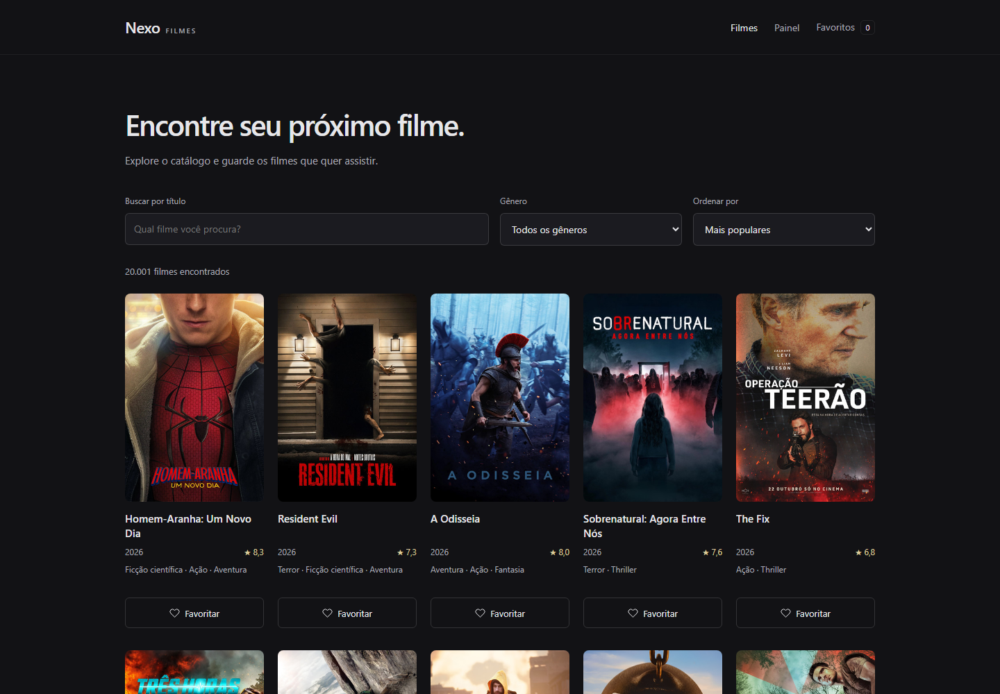
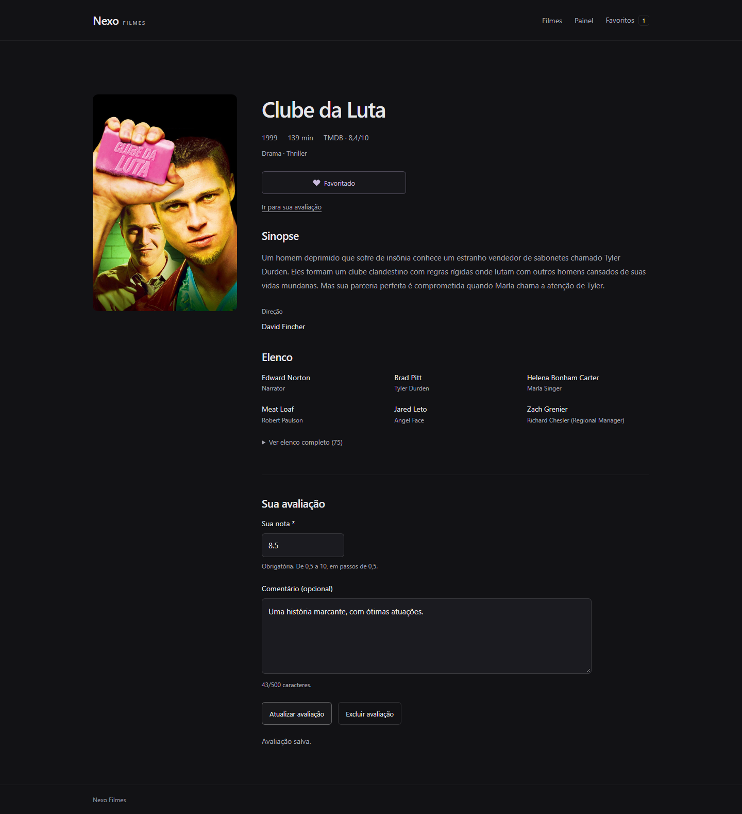
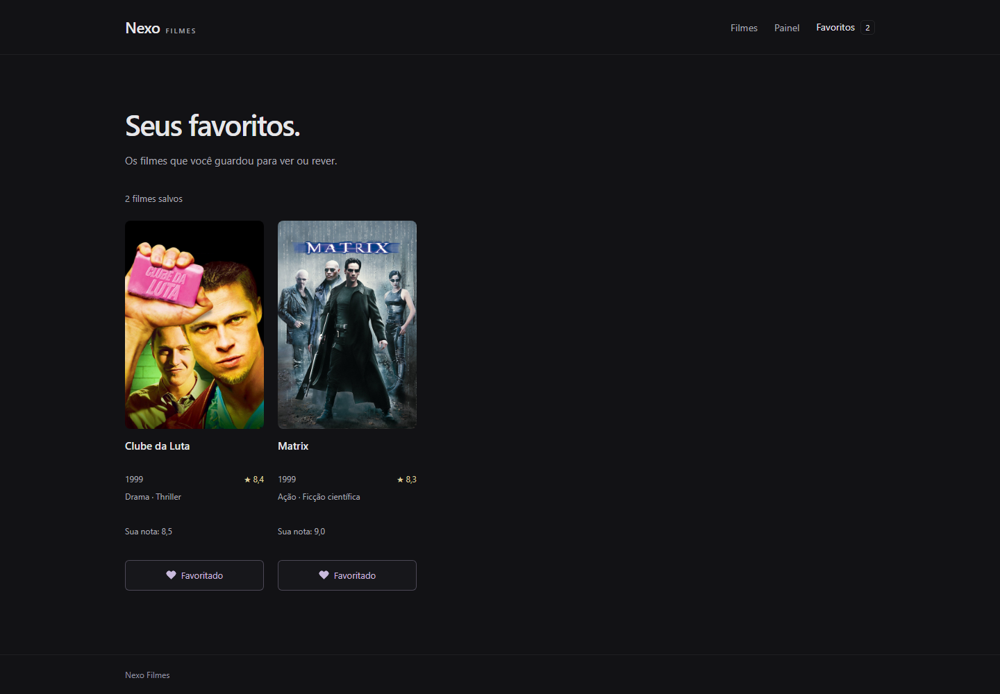
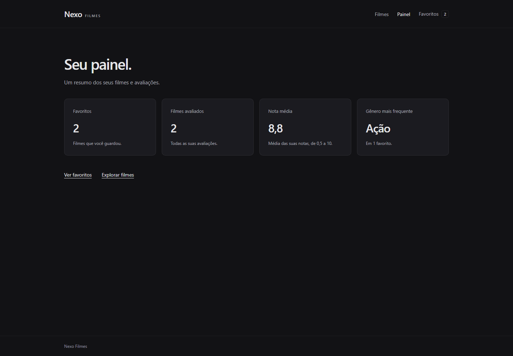
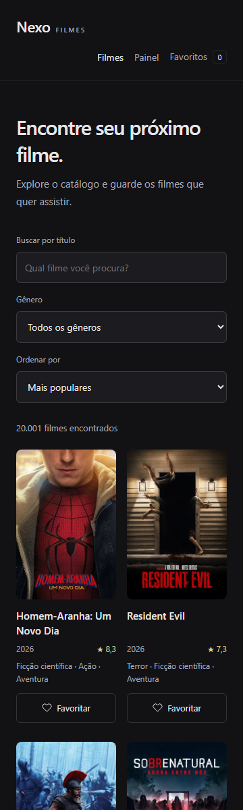
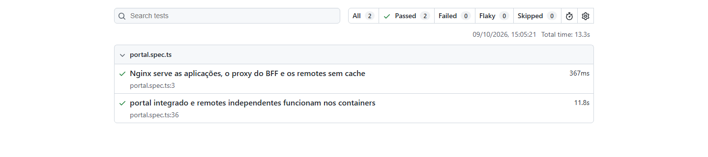
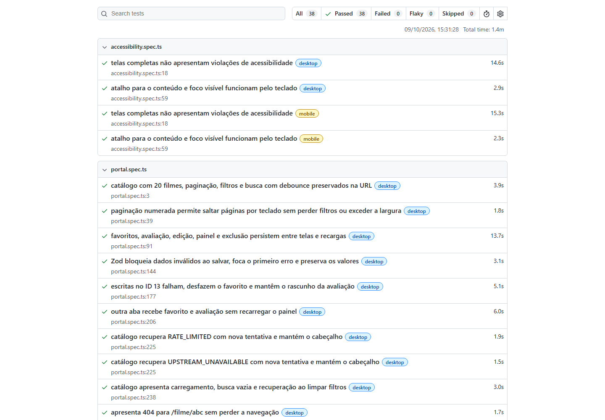
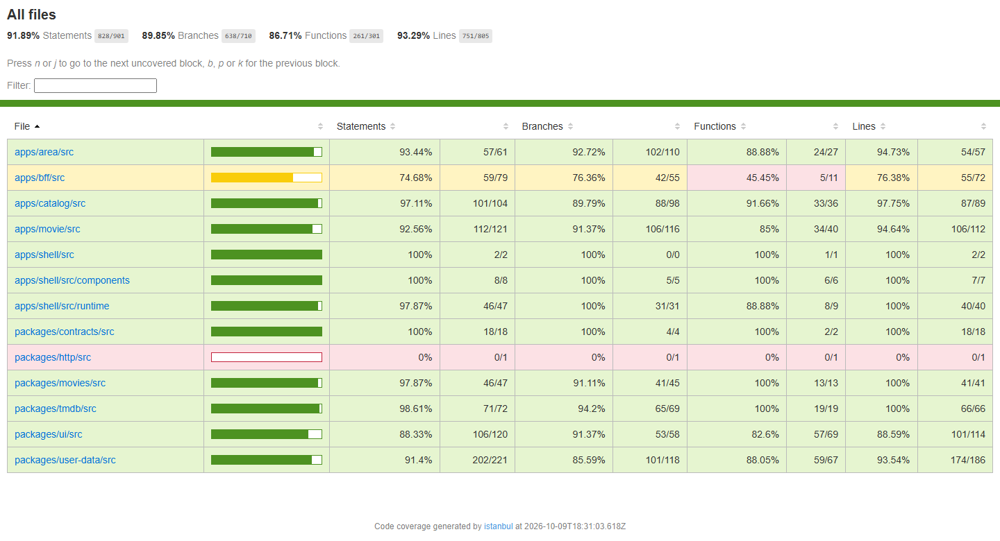

# Nexo Filmes

Portal de filmes com React 19, TypeScript strict, Module Federation, Axios, styled-components e npm workspaces.

[Execução com Docker](#docker) · [Telas](#telas) · [Resultados dos testes](#resultados-dos-testes)

## Requisitos

Para desenvolvimento e testes locais:

- Node.js 22.12 ou superior. Versão recomendada: Node.js 24, indicada em `.nvmrc`.
- npm 10 ou superior.

## Execução

Na raiz do repositório:

Copie `.env.example` para `.env` e preencha `TMDB_READ_ACCESS_TOKEN` com o **API Read Access Token** da TMDB. Se o `.env` já existir, mantenha os valores locais. O token é lido apenas pelo servidor.

```bash
npm install
npm run dev
```

| Aplicação  | Endereço              | Execução independente |
| ---------- | --------------------- | --------------------- |
| Shell      | http://127.0.0.1:4100 | `npm run dev:shell`   |
| Catálogo   | http://127.0.0.1:4101 | `npm run dev:catalog` |
| Filme      | http://127.0.0.1:4102 | `npm run dev:movie`   |
| Minha área | http://127.0.0.1:4103 | `npm run dev:area`    |
| BFF        | http://127.0.0.1:4200 | `npm run dev:bff`     |

`npm run dev` inicia o BFF e as quatro aplicações. `Ctrl+C` encerra os servidores. As portas do portal são fixas; uma porta ocupada interrompe a inicialização. Para rodar um remote separadamente com dados, inicie também o BFF. Os servidores Vite encaminham `/api` para ele.

`npm run dev:bff` observa mudanças no código do servidor. Na execução conjunta, reinicie `npm run dev` após alterar o BFF.

## Docker

Esta execução usa builds de produção e exige apenas Docker com Compose; Node.js e npm ficam nos containers.

1. Instale e abra o Docker Desktop com containers Linux. Confira a instalação com `docker compose version`.
2. Abra um terminal na raiz do repositório, onde estão `compose.yaml` e `Dockerfile`.
3. Copie `.env.example` para `.env` e preencha `TMDB_READ_ACCESS_TOKEN` com o **API Read Access Token** da TMDB. Se o `.env` já existir, mantenha os valores locais.
4. Encerre outros servidores que estejam usando as portas 4100 a 4103 e inicie os serviços com o comando abaixo.

Para copiar o ambiente no PowerShell, caso ele ainda não exista:

```powershell
Copy-Item .env.example .env
```

No Linux ou macOS:

```bash
cp .env.example .env
```

Após preencher o token, inicie o sistema:

```bash
docker compose up --build --wait
```

Abra [http://127.0.0.1:4100](http://127.0.0.1:4100). Os três remotes também ficam disponíveis nas portas 4101, 4102 e 4103, conforme a tabela de aplicações. A primeira execução baixa as imagens e instala as dependências; as próximas reutilizam as camadas de build. O comando retorna quando os cinco serviços estão saudáveis e deixa os containers em segundo plano.

```bash
docker compose ps
docker compose logs --tail=100
docker compose down
```

O `Dockerfile` usa etapas separadas para instalação, build e execução. Cada frontend recebe somente seu build e é servido por Nginx, com fallback de navegação, CORS nos remotes, assets com hash em cache e configuração runtime sem cache. O BFF usa Node.js 24, dependências de produção e um usuário sem privilégios de root. Os frontends aguardam a saúde do BFF na inicialização; um remote pode ser parado ou recriado independentemente.

O token é fornecido apenas ao ambiente do BFF durante a execução. O `.dockerignore` exclui todos os arquivos `.env`, dependências locais, relatórios e builds do contexto. O BFF escuta em `0.0.0.0:4200` dentro da rede dos containers; essa porta não é publicada no computador. Cada Nginx encaminha `/api` ao serviço `bff`. `BFF_HOST`, `BFF_PORT` e `NEXO_BFF_URL` do ambiente de desenvolvimento não alteram essa rede interna.

O Compose lê o `.env` da raiz e as variáveis do processo; arquivos `.env.local` e `.env.production` não são carregados por essa execução. As variáveis `VITE_PORTAL_URL` e `VITE_USER_DATA_*` são argumentos públicos de build: após modificá-las ou alterar o código, execute novamente `docker compose up --build --wait`.

As variáveis `NEXO_CATALOG_REMOTE_URL`, `NEXO_MOVIE_REMOTE_URL` e `NEXO_AREA_REMOTE_URL` configuram o JSON do Shell quando o container inicia. Use endereços acessíveis pelo navegador, como os padrões em `127.0.0.1`, e não os nomes internos dos serviços. Depois de alterar essas URLs no `.env`, aplique a configuração sem recompilar:

```bash
docker compose up --no-deps --force-recreate --wait shell
```

Favoritos e avaliações continuam no navegador, por origem. Ao acessar o mesmo endereço do desenvolvimento, os dados locais permanecem disponíveis; `docker compose down` não os remove. Nenhum banco ou volume de dados é necessário.

Para validar a configuração sem exibir os valores do ambiente, execute `docker compose config --quiet`. Com os containers em execução e as dependências de testes instaladas, `npm run test:docker` verifica saúde, proxy, configuração runtime, CORS, arquivos ausentes, rotas profundas, portal integrado, persistência e remotes independentes. As consultas de filmes são simuladas no navegador; a verificação HTTP de saúde utiliza o BFF real. O CI executa esses testes com uma credencial fictícia, sem chamar a TMDB.

Para executar esses testes localmente, também é necessário ter Node.js e npm no computador:

```bash
npm ci
npx playwright install chromium
npm run test:docker
```

O relatório Docker fica em `playwright-report-docker/`, separado do E2E. Abra-o com `npx playwright show-report playwright-report-docker`. Os arquivos de diagnóstico ficam em `test-results-docker/`.

Referências: [Docker Desktop no Windows](https://docs.docker.com/desktop/setup/install/windows-install/), [build em etapas](https://docs.docker.com/build/building/multi-stage/) e [ordem de inicialização no Compose](https://docs.docker.com/compose/how-tos/startup-order/).

## Telas

Capturas do portal em execução com Docker e dados reais da TMDB. Favoritos e avaliações exibidos são exemplos locais.

### Catálogo



<details>
<summary>Detalhe do filme e avaliação</summary>



</details>

<details>
<summary>Favoritos e notas pessoais</summary>



</details>

<details>
<summary>Painel pessoal</summary>



</details>

<details>
<summary>Catálogo em 360 px</summary>



</details>

## Resultados dos testes

Verificação local realizada em 9 de outubro de 2026:

| Verificação                               | Resultado            |
| ----------------------------------------- | -------------------- |
| Unitários e regras de negócio             | 152 testes aprovados |
| Componentes e acessibilidade no Storybook | 33 testes aprovados  |
| E2E em desktop e mobile                   | 38 testes aprovados  |
| Integração Docker                         | 2 testes aprovados   |
| Cobertura de linhas                       | 93,29%               |
| Arquitetura, tipos, lint e formatação     | Aprovados            |
| Builds do portal, BFF e Storybook         | Aprovados            |

As imagens abaixo são capturas dos relatórios gerados pelas suítes. Os testes de filmes usam respostas simuladas, sem depender da TMDB real.

### Integração Docker



<details>
<summary>E2E: 38 testes aprovados em desktop e mobile</summary>



</details>

<details>
<summary>Cobertura das regras de negócio</summary>



</details>

## Estrutura

```text
apps/
  shell/       # Entrada do portal
  catalog/     # Catálogo
  movie/       # Detalhes do filme
  area/        # Favoritos e painel
  bff/         # API de filmes e ambiente do servidor
packages/
  contracts/   # Tipos compartilhados
  http/        # Cliente HTTP com Axios
  movies/      # Cliente do BFF para as telas
  tmdb/        # Adapter da TMDB, exclusivo do servidor
  user-data/   # Repositório local e estado de favoritos e avaliações
  ui/          # Componentes e estilos comuns
scripts/       # Execução e verificação de arquitetura
tooling/       # Configuração de Vite e remotes
tests/         # Configuração de testes
```

O Shell carrega os três remotes com Module Federation. Cada aplicação possui configuração e build próprios, e pode executar de forma independente. React, React DOM, React Router e styled-components são compartilhados como singletons. Apenas as entradas independentes montam o router e o `UIProvider`; os componentes expostos utilizam os contextos do Shell.

Os pacotes compartilhados fornecem UI, contratos e infraestrutura HTTP. `npm run architecture` verifica importações estáticas, reexports e imports dinâmicos com caminho literal, impedindo dependências diretas entre aplicações e a importação do adapter da TMDB pelo navegador. As dependências são gerenciadas por um único `package-lock.json`.

Os estilos são definidos com styled-components, tema tipado e estilos globais aplicados pelo `UIProvider`. O pacote `@nexo/http` disponibiliza uma fábrica de clientes Axios com base URL configurável, timeout de 15 segundos e cabeçalho `Accept: application/json`. `@nexo/movies` consulta o BFF e valida os contratos retornados com Zod. `@nexo/tmdb` usa Axios com timeout de 12 segundos, `language=pt-BR` e autenticação Bearer. O navegador não recebe o token.

## Comandos

| Comando                   | Descrição                                            |
| ------------------------- | ---------------------------------------------------- |
| `npm run check`           | Arquitetura, tipos, lint, formato, testes e builds   |
| `npm run architecture`    | Verificação das importações entre aplicações         |
| `npm run typecheck`       | Verificação de tipos sem emitir arquivos             |
| `npm run lint`            | ESLint sem avisos                                    |
| `npm run format`          | Formatação com Prettier                              |
| `npm run build`           | Builds do BFF e das quatro aplicações em `dist/`     |
| `npm run preview`         | Prévia dos builds e BFF com ambiente de produção     |
| `npm run start:bff`       | Executa o build do BFF                               |
| `npm test`                | Testes com Vitest                                    |
| `npm run test:coverage`   | Relatório de cobertura V8                            |
| `npm run test:e2e`        | Testes de navegador com Playwright                   |
| `npm run test:e2e:report` | Abre o relatório HTML dos testes de navegador        |
| `npm run test:docker`     | Integração no portal iniciado pelo Docker Compose    |
| `npm run storybook`       | Catálogo interativo de componentes na porta 6006     |
| `npm run build:storybook` | Build estático da documentação de componentes        |
| `npm run test:storybook`  | Interações e acessibilidade dos exemplos no Chromium |

## Funcionamento

O workspace inclui Shell e três remotes integrados, navegação por URL, cabeçalho compartilhado e página 404. Cada região remota possui estado de carregamento, limite de espera de dez segundos e tratamento de erro com botão de nova tentativa. O contador do cabeçalho tem uma região de recuperação separada do conteúdo.

O catálogo consulta a TMDB pelo BFF e exibe até 20 filmes por página, com pôster, título, ano, nota e gêneros. Busca, gênero, ordenação e página ficam na URL. A busca aguarda 400 ms após a última alteração e cancela consultas anteriores. O detalhe exibe sinopse, duração, direção e elenco, permite favoritar e criar, editar ou excluir uma avaliação. A página de favoritos mostra a nota pessoal e permite remover filmes, com contador sincronizado no cabeçalho. O painel exibe totais de favoritos e avaliados, média das notas e gênero mais frequente entre os favoritos.

Os testes usam respostas simuladas e não acessam a TMDB. Verificam remotes, contratos, conversão de dados, cache, validação, rotas HTTP, consultas pela URL, debounce, cancelamento, limite de requisições, persistência e reversão de favoritos e avaliações. Os testes de formulário verificam mensagens por campo, foco no primeiro erro, preservação do rascunho, substituição e exclusão. O painel tem testes de cálculo, desempate, formatação, estados de leitura e atualização de métricas. `npm run test:coverage` exige pelo menos 70% de linhas em `tmdb`, `movies`, `user-data`, na normalização da consulta do catálogo, no formulário de avaliação e no cálculo de estatísticas. Os testes não leem o token local.

## Catálogo e favoritos

A paginação permite selecionar os números diretamente, com primeira e última página, setas anterior e próxima e reticências para intervalos maiores. A página atual fica sublinhada; a navegação preserva os filtros na URL.

Exemplos de URLs compartilháveis: `/filmes?page=2&genreId=18&sort=rating` e `/filmes?search=Matrix`. Gênero e ordenação reiniciam a paginação. A busca usa relevância; limpe o título para habilitar gênero e ordenação. Valores inválidos da URL são normalizados, e voltar ou avançar no navegador recupera a consulta.

`@nexo/user-data` centraliza o acesso ao `localStorage`, valida os dados com Zod e oferece operações assíncronas de favoritos e avaliações. O estado é compartilhado como singleton pelo Module Federation e observado com `useSyncExternalStore`. O evento tipado `nexo:user-data-changed` identifica o recurso e notifica carregamentos, alterações otimistas, gravações e reversões. Adicionar ou remover um favorito atualiza imediatamente as telas e o contador, exibe o estado de salvamento e restaura apenas o filme afetado se a escrita falhar.

Por padrão, cada leitura ou escrita aguarda de 300 a 1.500 ms. Gravações de filmes cujo ID termina em `13` falham, inclusive remoções de favoritos, salvamentos e exclusões de avaliações. A simulação pode ser configurada por `VITE_USER_DATA_DELAY_MIN_MS`, `VITE_USER_DATA_DELAY_MAX_MS` e `VITE_USER_DATA_FAIL_WRITES`; no modo `test` usado pelo Vitest ela fica desativada. Reinicie o desenvolvimento ou gere novo build após alterar essas variáveis.

Favoritos persistem no navegador, por origem, e mudanças em outras abas da mesma origem atualizam o estado. Aplicações independentes em portas distintas têm armazenamento separado. Seus links para outras aplicações usam `VITE_PORTAL_URL`, com padrão `http://127.0.0.1:4100`. Dados corrompidos ou armazenamento indisponível apresentam erro sem sobrescrever o conteúdo existente.

## Detalhes e avaliações

`/filme/:id` carrega os dados normalizados pelo BFF. IDs inválidos ou filmes inexistentes apresentam a página 404. Requisições são canceladas ao mudar de filme; respostas antigas não substituem a tela atual. Há estados para dados ausentes, carregamento e erro com nova tentativa. No remote independente, `/` abre `/filme/550`.

A avaliação é única por filme, com nota obrigatória de 0,5 a 10 em passos de 0,5 e comentário opcional de até 500 caracteres. Os campos preservam os valores digitados, sem correção automática da nota ou bloqueio de caracteres no comentário. Ao salvar, o schema Zod valida os campos e impede a gravação de dados inválidos. Cada campo inválido recebe sua mensagem e descrição acessível, o primeiro recebe foco e os valores permanecem no formulário.

Acessar `/filme/13` permite consultar o filme normalmente. Com a simulação de falhas ativada, o erro acontece ao tentar gravar um favorito ou uma avaliação, após o atraso do repositório.

Salvar novamente substitui a avaliação anterior. A nota pessoal nos favoritos muda imediatamente e volta ao valor anterior se a gravação falhar; o formulário mantém o rascunho para outra tentativa. Durante a escrita, os controles ficam desativados. A exclusão remove somente a avaliação, preserva o favorito e permite avaliar novamente. Uma atualização vinda de outra aba não sobrescreve um rascunho em edição.

Favoritos e avaliações usam registros versionados separados, `nexo-filmes:favorites:v1` e `nexo-filmes:reviews:v1`. Uma falha na leitura de avaliações não impede a lista ou o contador de favoritos. Remover um favorito preserva sua avaliação.

## Painel

`/painel` apresenta o total de favoritos, o total de filmes avaliados, a média de todas as notas pessoais com uma casa decimal e o gênero mais frequente entre os favoritos. Avaliações de filmes que não estão nos favoritos também entram no total de avaliados e na média. Cada gênero é contado uma vez por filme; empates usam a ordem alfabética em português.

Sem avaliações ou gêneros disponíveis, a métrica correspondente exibe `—`. Os recursos carregam de forma independente: uma falha nas avaliações preserva as estatísticas dos favoritos e oferece nova tentativa, e vice-versa. Mudanças otimistas e reversões atualizam as métricas sem recarregar a página, com indicação de salvamento. O painel utiliza os mesmos estados compartilhados das outras telas, sem novas consultas à TMDB.

## Testes de navegador e CI

Após instalar as dependências, instale o Chromium do Playwright uma vez:

```bash
npx playwright install chromium
npm run test:e2e
```

Em Linux, utilize `npx playwright install --with-deps chromium` para instalar também as bibliotecas do sistema. Para abrir o relatório da última execução, use `npm run test:e2e:report`.

A suíte executa os mesmos 19 cenários em desktop de 1440 px e celular de 360 px, totalizando 38 testes. Verifica paginação, busca com debounce, filtros na URL, favoritos, avaliações, painel, persistência após recarga, sincronização entre abas, validação e foco, rollback, carregamento, erro de API, 404, navegação por teclado e ausência de overflow horizontal. Também verifica as três aplicações independentes e a recuperação de uma falha de carregamento do remote.

As verificações com axe abrangem as telas completas, favoritos vazios e preenchidos, formulário inválido, erro da API e armazenamento indisponível. O teste de teclado verifica o atalho para o conteúdo, a ordem de foco e o contraste do contorno de foco em relação ao fundo.

O setup gera builds reais do Shell e dos remotes em `dist/e2e/`, inicia prévias nas portas 4300 a 4303 e encerra esses servidores ao terminar. As portas precisam estar livres. Os builds normais e as portas de desenvolvimento são preservados. As chamadas de API recebem respostas locais simuladas, sem iniciar o BFF ou exigir credenciais da TMDB. Cada teste utiliza um contexto de navegador com armazenamento isolado e grava dados pelos controles da interface.

No modo `e2e`, o repositório real mantém atraso fixo de 500 ms e falha nas escritas de IDs terminados em `13`, permitindo verificar estados otimistas, persistência e reversão. Falhas geram screenshot, vídeo e trace; o relatório HTML fica em `playwright-report/` e os arquivos de diagnóstico em `test-results/`. Esses diretórios são ignorados pelo Git.

O workflow `.github/workflows/ci.yml` executa em pushes, pull requests e acionamento manual. Com Node.js 24 e `npm ci`, verifica arquitetura, tipos, lint, formatação, cobertura e os builds do portal e do Storybook; após essa aprovação, executa os testes de componentes e os E2E. Os relatórios de cobertura e navegador ficam disponíveis como artefatos por sete dias. O workflow não precisa de secrets da TMDB.

Um job adicional gera as imagens Docker, inicia os cinco containers, verifica a alteração das URLs em runtime sem recompilar e executa `npm run test:docker`. A saúde e os testes de integração precisam passar; os containers são encerrados ao final, inclusive em falhas, e o relatório do navegador fica disponível como artefato.

Referências: [Playwright](https://playwright.dev/docs/intro), [setup e teardown](https://playwright.dev/docs/test-global-setup-teardown) e [GitHub Actions](https://docs.github.com/en/actions).

## Storybook

Na raiz, após instalar as dependências:

```bash
npm run storybook
```

Abra [http://127.0.0.1:6006](http://127.0.0.1:6006). A porta precisa estar livre; `Ctrl+C` encerra o servidor. O Storybook funciona sem iniciar o portal ou o BFF e sem credenciais da TMDB.

São 33 exemplos em sete grupos: card de filme, botão de favorito, carregamento, erro de requisição, página 404, layout do portal e formulário de avaliação. Os exemplos utilizam os componentes reais, o tema de styled-components e um router em memória. Os dados e o pôster demonstrativo são locais; as ações do formulário não gravam no `localStorage`.

Em **Documentação**, consulte a descrição, as propriedades e o código de uso de cada componente. Em **Controls**, altere os valores disponíveis para conferir seus estados. A ferramenta de viewport oferece desktop de 1440 px e celular de 360 px. O exemplo **Alternância** do favorito responde aos cliques; o formulário permite salvar, editar e excluir uma avaliação local.

Os exemplos de interação verificam os callbacks, a validação Zod, o foco no primeiro erro, a preservação do rascunho e a navegação por teclado. O painel **Accessibility** apresenta as verificações com axe. Para executar as interações e as verificações de acessibilidade automaticamente:

```bash
npx playwright install chromium
npm run test:storybook
```

O Chromium é compartilhado com os testes E2E e só precisa ser instalado uma vez. Não é necessário manter o servidor Storybook aberto para executar esses testes. No painel lateral **Component tests**, marque **Accessibility** e clique em **Run tests** para executar as duas verificações pela interface. As verificações de acessibilidade falham quando encontram uma violação nos exemplos; elas complementam a revisão manual por teclado e com leitor de tela.

`npm run build:storybook` gera `storybook-static/`, pronto para servir como site estático. Esse build e os testes de componentes também são verificados pelo CI; o build fica disponível como artefato por sete dias. As dependências de Storybook ficam em desenvolvimento e não entram nos builds do portal.

Referências: [React com Vite](https://storybook.js.org/docs/get-started/frameworks/react-vite), [testes de interação](https://storybook.js.org/docs/writing-tests/interaction-testing) e [acessibilidade](https://storybook.js.org/docs/writing-tests/accessibility-testing).

## URLs dos remotes

O Shell obtém `/runtime-config.json` pelo cliente Axios. Os endereços podem ser modificados sem recompilar o Shell:

```json
{
  "remotes": {
    "catalog": "http://127.0.0.1:4101/remoteEntry.js",
    "movie": "http://127.0.0.1:4102/remoteEntry.js",
    "area": "http://127.0.0.1:4103/remoteEntry.js"
  }
}
```

Em desenvolvimento, o arquivo está em `apps/shell/public/runtime-config.json`. Após o build, edite `dist/shell/runtime-config.json`. Nos servidores Vite, as variáveis `NEXO_CATALOG_REMOTE_URL`, `NEXO_MOVIE_REMOTE_URL` e `NEXO_AREA_REMOTE_URL` em `.env` sobrescrevem os endereços; reinicie os servidores após modificar essas variáveis. O arquivo `.env.example` contém os nomes disponíveis.

Uma nova tentativa busca novamente a configuração e invalida a entrada do remote. Em hospedagem estática, sirva o JSON sem cache, habilite CORS para os arquivos dos remotes e configure fallback de navegação para `index.html` em cada aplicação.

Para verificar os builds localmente, execute `npm run build` e `npm run preview`.

## Requisitos e verificação

O [guia de verificação](docs/validation.md) relaciona os requisitos à implementação e descreve os cenários manuais, incluindo as falhas de gravação nos IDs terminados em `13`.

## Escopo funcional

- `/filmes`: catálogo com 20 filmes por página, busca, gênero, ordenação e estado na URL.
- `/filme/:id`: informações do filme, direção, elenco, favoritos e avaliações.
- `/favoritos`: favoritos com nota pessoal e opção de remoção.
- `/painel`: totais, nota média e gênero mais frequente entre os favoritos.
- Contador de favoritos no cabeçalho, sincronizado entre telas.
- Avaliação única por filme: nota de 0,5 a 10 em passos de 0,5, comentário opcional de até 500 caracteres, edição e exclusão.

## Integração TMDB

O BFF oferece apenas rotas de leitura predefinidas; não recebe URLs externas nem encaminha cabeçalhos do navegador para a TMDB. Credenciais e detalhes internos das falhas não entram nas respostas JSON. O token fica em `TMDB_READ_ACCESS_TOKEN`, sem prefixo `VITE_`, e os arquivos de ambiente estão excluídos do Git.

| Rota                  | Parâmetros                          | Resposta                                     |
| --------------------- | ----------------------------------- | -------------------------------------------- |
| `GET /api/health`     | —                                   | Estado do processo                           |
| `GET /api/genres`     | —                                   | Gêneros: `id`, `name`                        |
| `GET /api/movies`     | `page`, `search`, `genreId`, `sort` | `items`, `page`, `totalPages`, `totalItems`  |
| `GET /api/movies/:id` | ID positivo                         | Filme com duração, sinopse, direção e elenco |

Exemplos: `/api/movies?page=2&genreId=18&sort=rating`, `/api/movies?search=Matrix&page=1` e `/api/movies/550`.

O catálogo usa `discover/movie`, enquanto a busca usa `search/movie`. Busca por título não é combinada com gênero ou ordenação: utiliza a relevância retornada pela TMDB. As opções de ordenação do catálogo são `popular`, `rating`, `newest` e `title`; a ordenação por nota considera pelo menos 200 votos. A paginação aceita páginas de 1 a 500. Gêneros são armazenados em memória por processo; uma consulta que falha não fica no cache.

Os dados são convertidos para os contratos do projeto: `posterUrl`, `year`, `tmdbRating` e gêneros completos. As imagens usam `w342` no catálogo e `w500` no detalhe. A direção considera profissionais com `job=Director`; o elenco segue a ordem dos créditos. Informações ausentes são representadas por `null`, texto vazio ou lista vazia conforme o contrato.

Erros têm o formato `{ "error": { "code": "...", "message": "..." } }`. Consultas inválidas retornam 400, filmes inexistentes 404, limite de requisições 429, indisponibilidade ou resposta externa inválida 502 e timeout 504. Em 429, o BFF preserva `Retry-After`, quando presente, e inclui `retryAfterSeconds`. O cliente retorna um erro tipado para que as telas apresentem a mensagem e uma nova tentativa; não há repetição automática de chamadas. Requisições do cliente aceitam `AbortSignal`.

`BFF_PORT` e `BFF_HOST` configuram o servidor, com valores padrão `4200` e `127.0.0.1`. `NEXO_BFF_URL` configura o destino do proxy Vite. Arquivos `.env.local`, `.env.<modo>` e `.env.<modo>.local` podem sobrescrever `.env`; variáveis do processo têm precedência. Alterações de ambiente exigem reiniciar os servidores. O comando `npm run start:bff` utiliza o modo indicado por `NODE_ENV`; `npm run preview` utiliza produção.

Em hospedagem, encaminhe `/api` ao BFF e forneça o token no ambiente do servidor. O build do BFF precisa de Node.js e das dependências instaladas. A saúde do processo não verifica credenciais nem disponibilidade externa.

Referências: [autenticação](https://developer.themoviedb.org/docs/authentication-application), [discover](https://developer.themoviedb.org/reference/discover-movie), [busca](https://developer.themoviedb.org/reference/search-movie), [créditos no detalhe](https://developer.themoviedb.org/docs/append-to-response) e [limite de requisições](https://developer.themoviedb.org/docs/rate-limiting).
